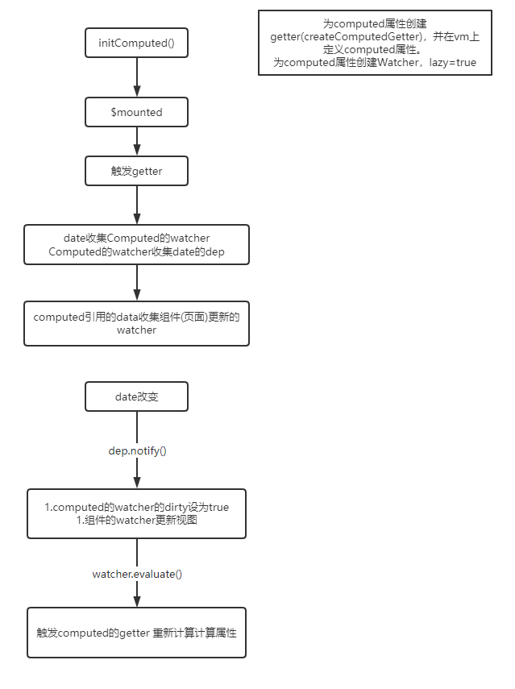

# Vue 双向绑定简单实现
---


## Watch
##### 初始化(initWatcher)
```
1. 为每个watch 新建一个watcher
2. 执行一次get()，通过this.getter()实现data对watch的watcher的收集
```
* 为每个watch 新建一个watcher
* 执行一次get()，通过this.getter()实现data对watch的watcher的收集
```js
    // 简化版
    Watcher.prototype.get = function() {
    // 这里会触发到data内属性的get 方法 从而收集到 watch 的 watcher
    var value = this.getter(this.vm);
    return value
    };
```
* watcher updata的时候 this.value为旧值(oldVal) 新的值为this.get()
* deep的实现是 通过travel方法递归watch的属性保证每个子属性都收集到watch的watcher，从而实现深度监听

## Computed
##### 1.初始化（initComputed）
* 为computed属性创建getter，并在vm上定义computed属性。
* 为computed属性创建Watcher，lazy=true
```js
const computedWatcherOptions = { lazy: true }

function initComputed (vm: Component, computed: Object) {
  const watchers = vm._computedWatchers = Object.create(null)
  const isSSR = isServerRendering()

  for (const key in computed) {
    const userDef = computed[key]
    const getter = typeof userDef === 'function' ? userDef : userDef.get
		// ...
    // if (!isSSR) {
    //   watchers[key] = new Watcher(
    //     vm,
    //     getter || noop,
    //     noop,
    //     computedWatcherOptions
    //   )
    // }
		// ...
    if (!(key in vm)) {
      defineComputed(vm, key, userDef)
    } 
  }
}
function defineComputed(

    target, key, userDef

) {

    // 设置 set 为默认值，避免 computed 并没有设置 set

    var set = function(){}
    //  如果用户设置了set，就使用用户的set

    if (userDef.set) set = userDef.set


    Object.defineProperty(target, key, {

        // 包装get 函数，主要用于判断计算缓存结果是否有效

        get:createComputedGetter(key),

        set:set

    });
}

function createComputedGetter(key) {

    return function() {

        // 获取到相应 key 的 computed-watcher

        var watcher = this._computedWatchers[key];

        // 如果 computed 依赖的数据变化，dirty 会变成true，从而重新计算，然后更新缓存值 watcher.value

        if (watcher.dirty) {
            watcher.evaluate();

        }

        // 这里是 月老computed 牵线的重点，让双方建立关系

        if (Dep.target) {
            watcher.depend();

        }

        return watcher.value

    }
}
```
##### 2.运作流程
1. 在初始化完成后，$mount()方法进行渲染模板时，会读取计算属性的值，从而触发计算属性的get方法(createComputedGetter创建的函数)。这时dirty = true，执行watcher.evaluate()。
   执行时会将Dep.target设置为computed的watcher(设置前会把原来的target给缓存起来，来实现给data收集页面的watcher)，这时候get中使用到的data属性都会将computed的watcher加入dep中（用于在data改变时将ditty 设为true），computed的watcher也会收集data的Dep
   （用于后续对data的dep中添加组件[页面]的watcher）
2. 通过watcher.depend();对使用到的data的dep 收集 页面的watcher。
3. 所以data改变时的运作流程: data改变 --> 触发computed的watcher，将dirty 设为true --> 触发组件（页面）的watcher更新视图 --> 视图更新触发computed的get --> dirty 为 true 则重新计算
   （执行getter） 为false 则直接返回缓存。 也就是这样实现对计算属性的缓存
   
